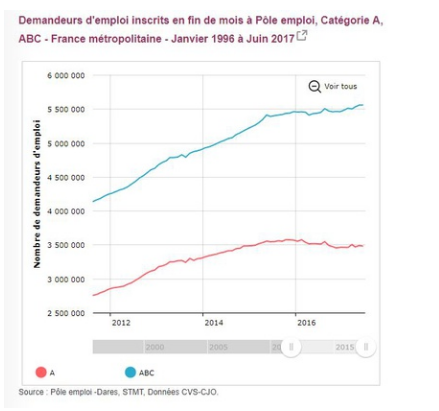
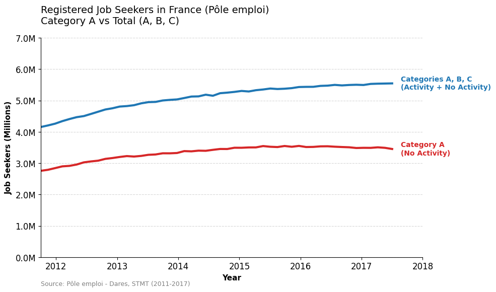
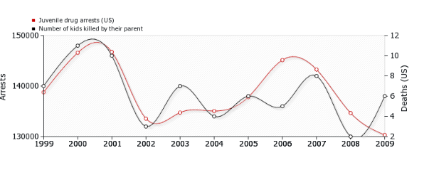
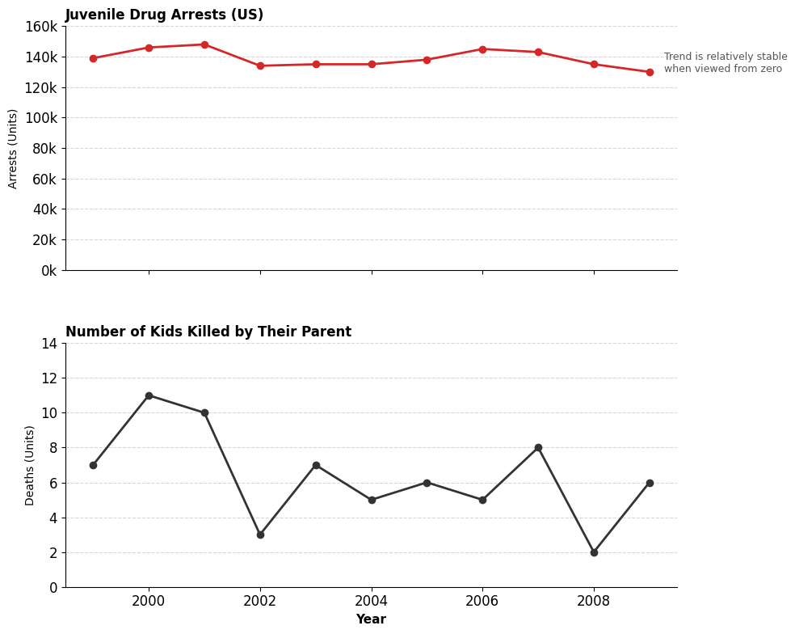
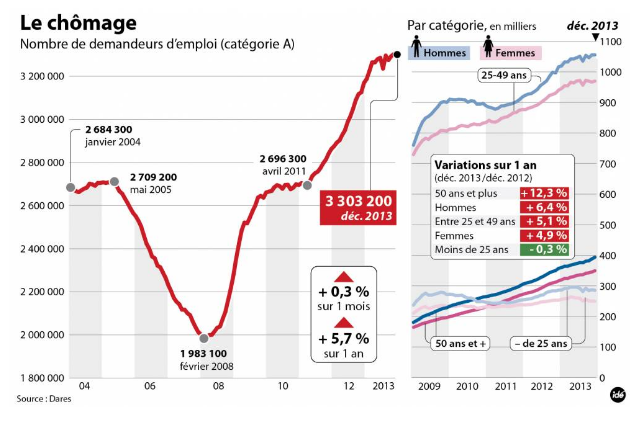
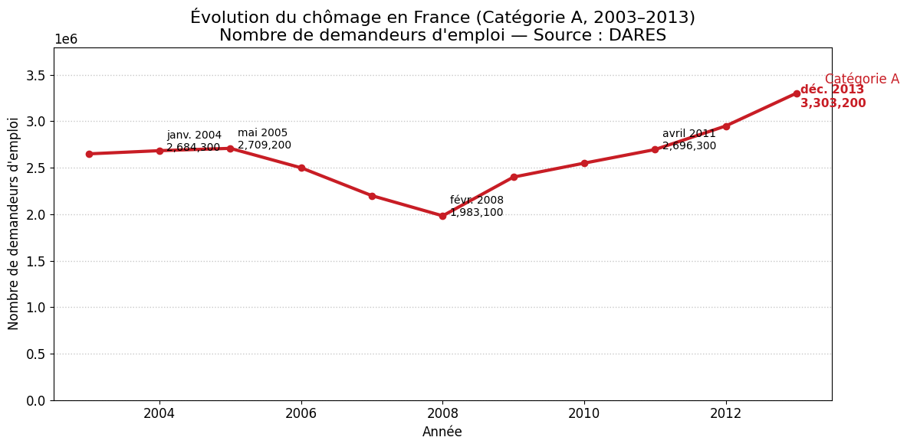
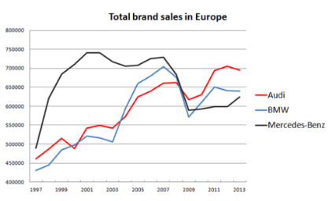
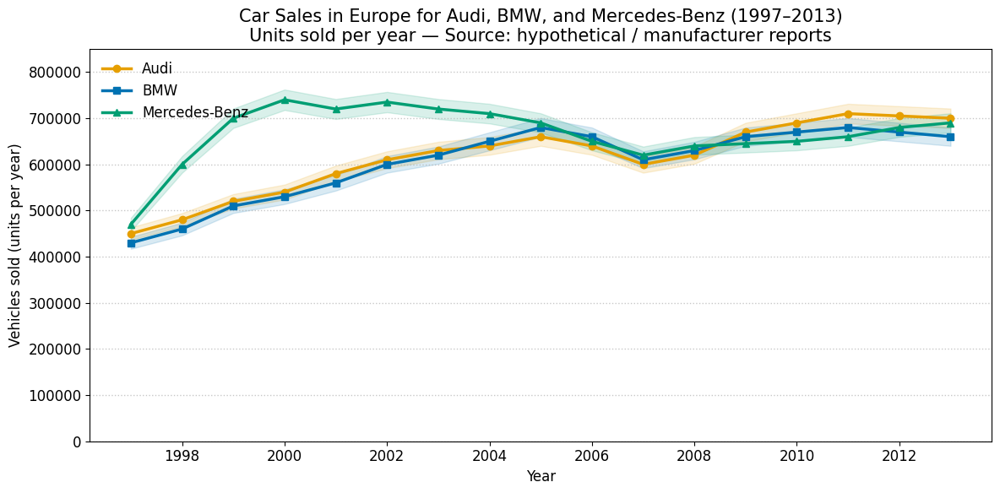

# Good Graphics Exercise

## Homework Assignment

Critique 4 figures using the official checklist for good graphics.

## Resources

- **Slides**: [What a nice picture! Data Visualization, an introduction](https://github.com/alegrand/SMPE/blob/master/sessions/2025_10_Grenoble/README.org)
- **Checklist**: Official good graphics checklist from lecture

---

## Figure 1: French Job Seekers (Demandeurs d'emploi)

### Original

**Description:** Time series of job seekers registered at Pôle emploi, Categories A and ABC, France, January 1996 to June 2017.

### 1. DATA

| ✓/✗ | Criterion | Assessment |
|-----|-----------|------------|
| ✓ | Graphic type adapted | Line plot appropriate for time series |
| ✓ | Interpolation makes sense | Linear interpolation valid for monthly data |
| ✓ | Sufficient points | ~250 months, good resolution |
| ✓ | Curve building method clear | Standard time series |
| ✗ | Confidence intervals shown | Missing. Survey data should show uncertainty |
| N/A | Histogram steps | Not applicable |
| N/A | Histograms show probabilities | Not applicable |

### 2. GRAPHICAL OBJECTS

| ✓/✗ | Criterion | Assessment |
|-----|-----------|------------|
| ✗ | Readable on print/screen | Web interface elements (slider, button) not print-ready |
| ✗ | Standard color range | Pink/teal may not be colorblind-friendly |
| ✓ | Axes identified and labelled | Y-axis labeled "Nombre de demandeurs d'emploi" but nothing on the X-Axis |
| ✗ | Scales and units explicit | Numbers formatted "6 000 000" hard to read; no unit stated |
| ✓ | Curves cross without ambiguity | Two curves clearly distinguished |
| ✓ | Grids help reader | Horizontal gridlines aid value reading |

### 3. ANNOTATIONS

| ✓/✗ | Criterion | Assessment |
|-----|-----------|------------|
| ✓ | Axes labelled by quantities | Y-axis shows "Nombre de demandeurs d'emploi" but nothing on X-Axis |
| ✗ | Labels self-contained | Categories "A" and "ABC" undefined |
| ✗ | Units on axes | Missing unit (persons/individuals) and years |
| ✓ | Axes oriented correctly | Left-right, bottom-top |
| ✓ | Origin (0,0) or justified | Starts near zero, appropriate |
| ✓ | No holes on axes | Continuous series |
| ✓ | Each curve has legend | Color-coded legend present |

### 4. INFORMATION

| ✓/✗ | Criterion | Assessment |
|-----|-----------|------------|
| ✓ | Curves on same scale | Both use same Y-axis |
| ✓ | Curve count reasonable | Two curves, optimal |
| ✓ | Curves compared on same graphic | Effective comparison |
| ✓ | Cannot remove curve without info loss | Both needed |
| ✓ | Gives relevant information | Clear trend visualization |
| ✗ | Error bars for averages | No uncertainty shown |
| ✗ | Cannot remove objects | Web UI elements should be removed |

### 5. CONTEXT

| ✓/✗ | Criterion | Assessment |
|-----|-----------|------------|
| ✗ | Symbols defined | Categories A and ABC not explained |
| ✓ | More info than alternatives | Visual better than table for trends |
| ✓ | Has title | Comprehensive title present |
| ✗ | Title self-contained | Categories undefined in title |
| ✓ | Referenced/sourced | "Pôle emploi - Dares, STMT, Données CVS-CJO" |

**Summary of Main Issues:**
- Web interface artifacts (slider, button, zoom in and out)
- Categories A/ABC undefined
- No confidence intervals
- Poor number formatting (6 000 000)
- No explicit unit

### Improved Version

**Changes Made:**
- Categories explained in subtitle: "Category A vs Total (A, B, C)" with clarification "Activity + No Activity" and "No Activity"
- Y-axis labeled with unit: "Job Seekers (Millions)"
- X-axis labeled: "Year"
- Abbreviated numbers: 7.0M, 6.0M, etc.
- Y-axis starts at 0
- Source clearly cited
- Web interface artifacts removed
- Colorblind-friendly colors (blue/red)

---

## Figure 2: Juvenile Drug Arrests vs Kids Killed by Parents

### Original

**Description:** Dual Y-axis plot comparing juvenile drug arrests (US) with number of kids killed by their parents, 1999-2009.

### 1. DATA

| ✓/✗ | Criterion | Assessment |
|-----|-----------|------------|
| ✓ | Graphic type adapted | Line plot appropriate for time series |
| ✓ | Interpolation makes sense | Linear interpolation valid for annual data |
| ? | Sufficient points | 11 years barely adequate |
| ✓ | Curve building method clear | Standard time series |
| ✗ | Confidence intervals shown | Missing for both datasets |
| N/A | Histogram steps | Not applicable |
| N/A | Histograms show probabilities | Not applicable |

### 2. GRAPHICAL OBJECTS

| ✓/✗ | Criterion | Assessment |
|-----|-----------|------------|
| ✗ | Readable on print/screen | Circles on lines may overlap, hard to distinguish colors |
| ✗ | Standard color range | Red/black similar, not colorblind-friendly |
| ✗ | Axes identified and labelled | Left Y-axis labeled "Arrests", right Y-axis labeled "Deaths (US)", but X-axis unlabeled |
| ✗ | Scales and units explicit | Right axis says "(US)" but unclear what that means as a unit |
| ? | Curves cross without ambiguity | Similar colors make distinction difficult |
| ✓ | Grids help reader | Horizontal gridlines present |

### 3. ANNOTATIONS

| ✓/✗ | Criterion | Assessment |
|-----|-----------|------------|
| ✗ | Axes labelled by quantities | Left: "Arrests" (acceptable), Right: "Deaths (US)" (confusing), X: unlabeled |
| ✗ | Labels self-contained | "(US)" on right axis unclear - location or unit? |
| ✗ | Units on axes | No proper units. Arrests per year? Deaths per year? |
| ✓ | Axes oriented correctly | Left-right, bottom-top |
| ? | Origin (0,0) or justified | Neither axis starts at zero, not clearly justified |
| ✓ | No holes on axes | Continuous time series |
| ✓ | Each curve has legend | Legend in top-left identifies both series |

### 4. INFORMATION

| ✓/✗ | Criterion | Assessment |
|-----|-----------|------------|
| ✗ | Curves on same scale | Different scales (dual Y-axis) can be misleading |
| ✓ | Curve count reasonable | Two curves |
| ✗ | Curves compared on same graphic | Dual Y-axis makes comparison problematic - can manipulate perception |
| ✓ | Cannot remove curve without info loss | Both series needed for comparison |
| ✗ | Gives relevant information | Dual Y-axis can create false correlation appearance |
| ✗ | Error bars for averages | No uncertainty shown |
| ✓ | Cannot remove objects | All elements serve purpose |

### 5. CONTEXT

| ✓/✗ | Criterion | Assessment |
|-----|-----------|------------|
| ? | Symbols defined | Circle markers not explained |
| ? | More info than alternatives | Dual Y-axis often misleading; separate plots might be clearer |
| ✗ | Has title | No title present |
| N/A | Title self-contained | No title to evaluate |
| ? | Referenced/sourced | No source provided |

**Summary of Main Issues:**
- Dual Y-axis can be misleading (implies correlation)
- No title
- No source
- X-axis unlabeled
- No confidence intervals
- Neither axis starts at zero
- Colors not colorblind-friendly
- No units specified (per year?)

**Critical:** Dual Y-axis graphs are controversial - they can create false impressions of correlation by scaling independently.

### Improved Version

**Changes Made:**
- Dual Y-axis eliminated: Split into two separate, aligned plots
- Both plots have titles: "Juvenile Drug Arrests (US)" and "Number of Kids Killed by Their Parent"
- X-axis labeled: "Year" on both plots
- Y-axis units specified: "Arrests (Units)" and "Deaths (Units)"
- Both Y-axes start at 0
- Added annotation: "Trend is relatively stable when viewed from zero"
- Now shows true scale without manipulation

---

## Figure 3: Le chômage (Unemployment)

### Original

**Description:** French unemployment data, category A, 2004-2013, with multiple annotations and inset graphs showing demographic breakdowns.

### 1. DATA

| ✓/✗ | Criterion | Assessment |
|-----|-----------|------------|
| ✓ | Graphic type adapted | Line plot for time series, insets show additional breakdowns |
| ✓ | Interpolation makes sense | Linear interpolation valid |
| ✓ | Sufficient points | Monthly data over 9 years, good resolution |
| ✓ | Curve building method clear | Standard time series |
| ✗ | Confidence intervals shown | Missing for all data |
| N/A | Histogram steps | Not applicable |
| N/A | Histograms show probabilities | Not applicable |

### 2. GRAPHICAL OBJECTS

| ✓/✗ | Criterion | Assessment |
|-----|-----------|------------|
| ✗ | Readable on print/screen | Too much information, cluttered, overlapping elements |
| ✗ | Standard color range | Multiple colors, inconsistent usage |
| ✗ | Axes identified and labelled | Main axis labeled but inset axes unclear |
| ✗ | Scales and units explicit | Multiple scales create confusion; no explicit units |
| ✗ | Curves cross without ambiguity | Overlapping annotations obscure data |
| ✗ | Grids help reader | Grid present but overwhelmed by annotations |

### 3. ANNOTATIONS

| ✓/✗ | Criterion | Assessment |
|-----|-----------|------------|
| ✓ | Axes labelled by quantities | Main Y-axis shows unemployment numbers |
| ✗ | Labels self-contained | Too many labels, creates confusion rather than clarity |
| ✗ | Units on axes | Implicit from numbers but not stated |
| ✓ | Axes oriented correctly | Standard orientation |
| ? | Origin (0,0) or justified | Y-axis truncated, not clearly justified |
| ✓ | No holes on axes | Continuous |
| ✗ | Each curve has legend | Multiple curves in insets, legends unclear |

### 4. INFORMATION

| ✓/✗ | Criterion | Assessment |
|-----|-----------|------------|
| ✗ | Curves on same scale | Multiple scales across insets create confusion |
| ✗ | Curve count reasonable | Too many curves (main + 3 insets with multiple lines each) |
| ✗ | Curves compared on same graphic | Different scales make comparison difficult |
| ✗ | Cannot remove curve without info loss | Could remove many annotations without losing core information |
| ✗ | Gives relevant information | Information overload reduces clarity |
| ✗ | Error bars for averages | No uncertainty shown |
| ✗ | Cannot remove objects | Many annotations could be removed to improve readability |

### 5. CONTEXT

| ✓/✗ | Criterion | Assessment |
|-----|-----------|------------|
| ✗ | Symbols defined | Various symbols and colors not all clearly defined |
| ✗ | More info than alternatives | Too much information; separate figures would be clearer |
| ✓ | Has title | "Le chômage" with subtitle |
| ✗ | Title self-contained | Title too brief for complexity shown |
| ✓ | Referenced/sourced | "Source: Dares" |

**Summary of Main Issues:**
- Severe information overload (chart junk) which Violates Tufte's principle
- Too many curves, annotations, insets
- Overlapping text obscures data
- Multiple scales confuse comparison
- Red boxes and arrows distract
- Inconsistent color usage
- Could be 4-5 separate, clearer figures

### Improved Version

**Changes Made:**
- Radical simplification: Single trend line only, removed all insets
- Y-axis starts at 0
- Both axes labeled: "Nombre de demandeurs d'emploi" and "Année"
- Only 5 key data points labeled (min, max, key turning points)
- Source prominently displayed in subtitle: "Source : DARES"
- All chart junk removed (boxes, arrows, percentage callouts)
- Clean, professional appearance
- Category specified in title: "Catégorie A"

---

## Figure 4: Total Brand Sales in Europe

### Original

**Description:** Car sales for Audi, BMW, and Mercedes-Benz in Europe, 1997-2013.

### 1. DATA

| ✓/✗ | Criterion | Assessment |
|-----|-----------|------------|
| ✓ | Graphic type adapted | Line plot appropriate for time series |
| ✓ | Interpolation makes sense | Linear interpolation valid for annual sales |
| ✓ | Sufficient points | 17 years, adequate resolution |
| ✓ | Curve building method clear | Standard time series |
| ✗ | Confidence intervals shown | Missing. Sales data has uncertainty |
| N/A | Histogram steps | Not applicable |
| N/A | Histograms show probabilities | Not applicable |

### 2. GRAPHICAL OBJECTS

| ✓/✗ | Criterion | Assessment |
|-----|-----------|------------|
| ✓ | Readable on print/screen | Clean, simple design prints well |
| ✗ | Standard color range | Red/blue/black - red/blue difficult for colorblind users |
| ✗ | Axes identified and labelled | Neither axis has labels |
| ✗ | Scales and units explicit | Y-axis numbers present but no unit label (vehicles? thousands?) |
| ✓ | Curves cross without ambiguity | Three brands clearly distinguished |
| ✓ | Grids help reader | Horizontal gridlines aid reading |

### 3. ANNOTATIONS

| ✓/✗ | Criterion | Assessment |
|-----|-----------|------------|
| ✗ | Axes labelled by quantities | No Y-axis label (sales? units? revenue?), no X-axis label |
| ✗ | Labels self-contained | Missing axis labels reduce self-containment |
| ✗ | Units on axes | Y-axis numbers shown but unit undefined |
| ✓ | Axes oriented correctly | Standard orientation |
| ? | Origin (0,0) or justified | Y-axis starts at 400000, truncation not justified |
| ✓ | No holes on axes | Continuous series |
| ✓ | Each curve has legend | Legend identifies three brands |

### 4. INFORMATION

| ✓/✗ | Criterion | Assessment |
|-----|-----------|------------|
| ✓ | Curves on same scale | All use same Y-axis |
| ✓ | Curve count reasonable | Three curves, good for comparison |
| ✓ | Curves compared on same graphic | Effective comparison of competitors |
| ✓ | Cannot remove curve without info loss | All three brands needed for competitive analysis |
| ✓ | Gives relevant information | Clear market trends and competitive positions |
| ✗ | Error bars for averages | No uncertainty shown |
| ✓ | Cannot remove objects | All elements serve purpose |

### 5. CONTEXT

| ✓/✗ | Criterion | Assessment |
|-----|-----------|------------|
| ✓ | Symbols defined | Three brands clearly identified in legend |
| ✓ | More info than alternatives | Time series shows trends better than table |
| ✓ | Has title | "Total brand sales in Europe" |
| ✗ | Title self-contained | Doesn't specify units (vehicles? thousands? millions?) |
| ✗ | Referenced/sourced | No source cited |

**Summary of Main Issues:**
- No axis labels
- No units specified (number of cars? thousands? millions?)
- No source
- Y-axis truncated (starts at 400k) - exaggerates differences
- Colors not colorblind-friendly
- No confidence intervals

### Improved Version

**Changes Made:**
- Both axes labeled: "Vehicles sold (units per year)" and "Year"
- Units specified in Y-axis label and subtitle
- Y-axis starts at 0 (not truncated)
- Source added to subtitle: "hypothetical / manufacturer reports"
- Colorblind-friendly colors: Orange (Audi), Blue (BMW), Teal (Mercedes-Benz)
- All three brands identified in legend with markers
- Title specifies all brands: "Audi, BMW, and Mercedes-Benz"
- Clean grid for easy value reading

---
