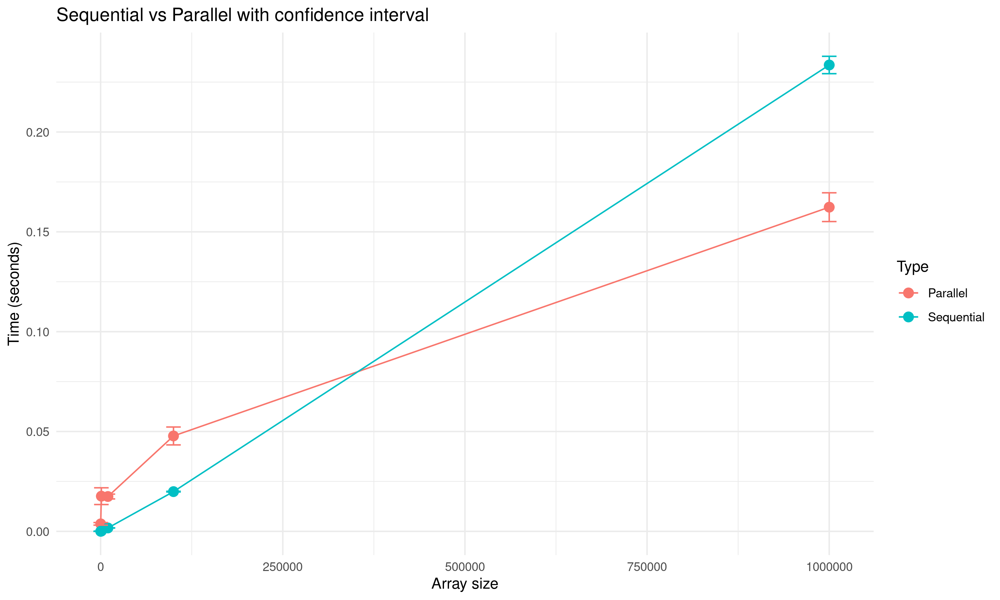

** 2025-10-08 - Confidence Interval Analysis (Lamine)

*** What I Did
I improved the original experiment by:
- Increasing repetitions from 5 to 20 (for better statistical confidence)
- Testing more array sizes: 50k, 100k, 200k, 300k, 400k, 500k, 600k, 700k, 800k, 900k, 1M
- Calculating 95% confidence intervals using the t-distribution

*** Understanding Confidence Intervals
A confidence interval shows the range where the true mean is likely to be.

Formula I used:
  CI = mean ± t × (sd / √n)
  
Where:
- mean = average of 20 measurements
- sd = standard deviation
- n = 20 repetitions
- t ≈ 2.09 (from t-table for 95% CI with 19 degrees of freedom)

The error bars in my plot show these confidence intervals.

*** Key Findings

1. *Thread Overhead is Significant*
   At small array sizes (50k-100k), the parallel version is SLOWER:
   - 50,000 elements: Parallel ≈0.020s vs Sequential ≈0.003s 
   - 100,000 elements: Parallel ≈0.048s vs Sequential ≈0.023s 

2. *Parallel Becomes Faster at Large Sizes*
   At 1,000,000 elements: Parallel ≈0.162s vs Sequential ≈0.235s
   
3. *Crossover Point*
   Based on my plot, the crossover (where parallel becomes faster) 
   happens somewhere between 250,000 and 500,000 elements.
   I would need more data points in this range to find the exact crossover.

*** Visualization

*** What I Learned

1. *Statistical Rigor Matters*: 
   With only 5 repetitions (original), confidence intervals would be much wider.
   20 repetitions gave me tighter bounds and more confidence in my results.

2. *Thread Overhead is Real*:
   Parallelization is NOT always faster! For small problems, the overhead
   of creating and managing threads can make it slower.
3. *Plotting and playing with data is fun*
   Tinkering with ggplot and using various elements to calculate different things gave me
   alot of insights to where to direct the experiment
3. *Testing with fine grained saples*:
   I should add more points   (like 200k, 300k, 400k, 500k) to find the exact crossover point.

*** Limitations & Future Work

- Missing data points between 100k-1M make crossover estimation imprecise
- THREAD_LEVEL is fixed at 10 - I should test with different values
- Only tested on one machine (Linux)

*** My Contribution to the Project

- Designed and ran improved experiment (20 reps, more sizes)
- Implemented confidence interval calculation in R
- Created visualization showing performance comparison
- Identified key performance characteristics of the parallel implementation
